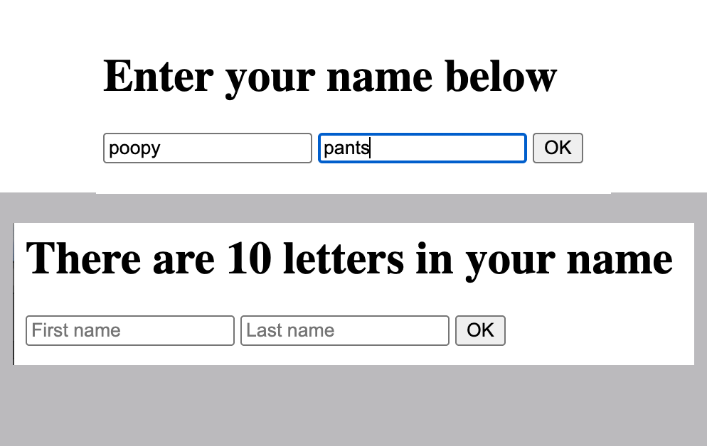

# Passing Data FE to BE

This example uses form to collect firstname and lastname. Those are passed to the server request in POST in body object. We return a new title to the user using those two variables.

We also return the count of letters in the concatenated first + last name.

