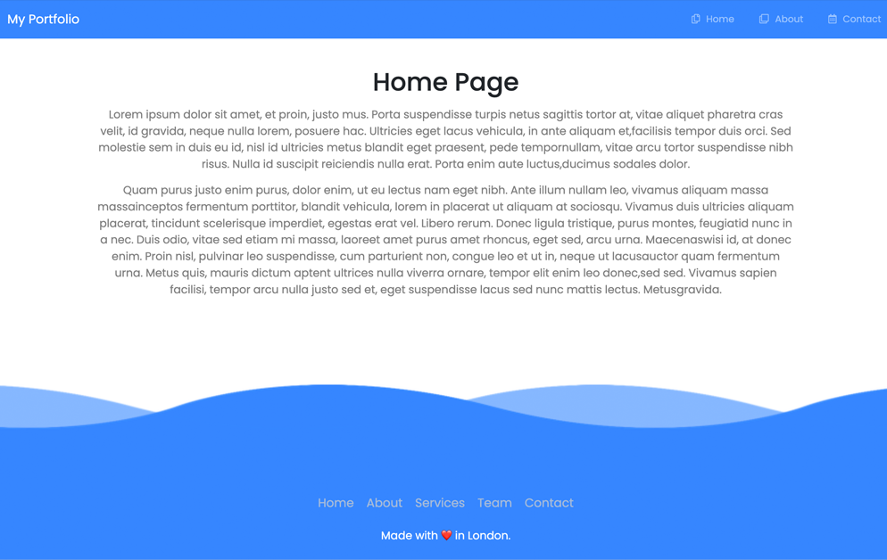

# EJS Partials

Partials are ways you can split out code that can be reusable and imported into different pages. This helps to prevent redundant code.

## Partial Examples

EJS partials can be used to create header and footer files that you can include in all your pages (index, about, contact). Similar to a reusable React component.

## How to Use

Simply add `<%- include("partials/header.ejs") %>` into your file. The partial file just contains HTML and .ejs filename.

## Static files (public folder)

We also use static files from public folder (images and styles). To do that we write this in our index.js file: `app.use(express.static('public'))`

## EJS Tag Examples

- `<%= variable %>`  - interpreted JS with an output
- `<% console.log(’hello’) %>` - can write JS inside HTML, no output when converted to HTML
- `<%- <h1>Hello</h1> %>` - will get rendered as that tag
- `<%% %%>` - escape ejs tag either add it before or after the end tag
- `<%# this is a comment %>` - none will get executed, interpreted or rendered
- `<%- include(’header.ejs’) %>` - add another ejs inside this ejs, can be used to create layout (header, footer that doesn’t change) body gets changed out for different links.
