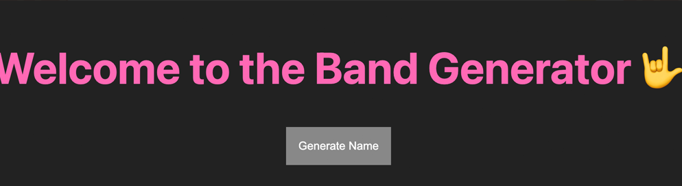

# Band Generator Project

This uses all tools up to this point. (partials, static files, ejs tags, form with POST request.)

## What it does

Display an h1 tag to user. If user fills out form the h1 will change to the randomized band name.

## How it works

A function takes randomized item from adj array and randomized item from noun array and concats them back to the user. This is an example of using Math.random() to generate a random index number for each array.
