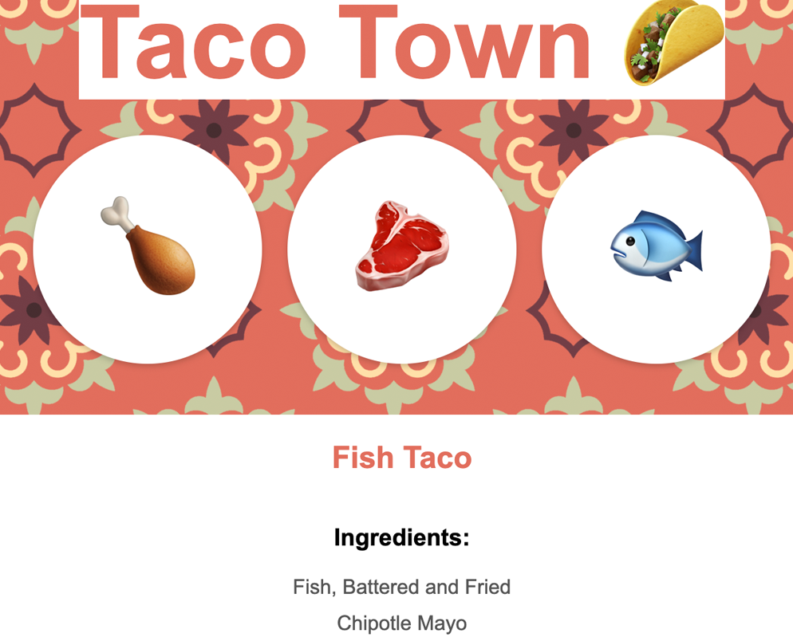

# JSON

An array of recipes is provided as JSON data.



## How it works

We set up express server. Point to our public folder for static assets.
Our index shows a bunch of recipe info and a form. It allows user to select a chicken, fish or beef button. The clicked item is sent back to server on POST, then use `JSON.parse(recipeJSON).find()` to loop through all data to find the objects that match the selection.

## What is JSON

- It is different from JS objects in that the keys are all strings.
- can be serialized or packaged for easier transfer
- JSON visualizer - jsonviewer.stack.hu

To convert JS object -> JSON string

```
const jsonData = JSON.stringify(data);
```

To convert JSON -> JS object

```
const data = JSON.parse(jsonData);
```
