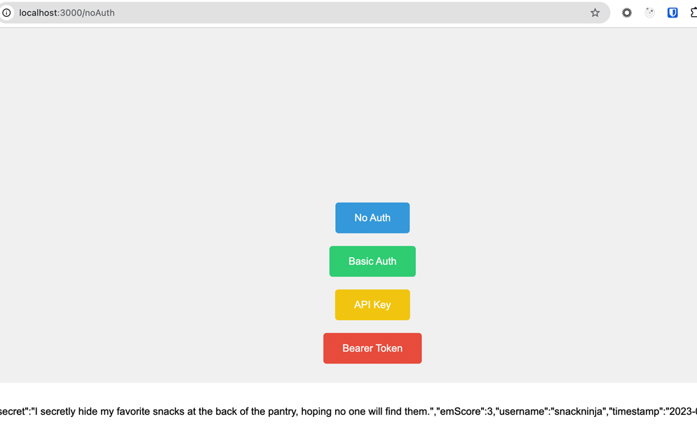

# API Authentication

Each button use the https://secrets-api.appbrewery.com/. We created a auth api key and a bearer token using these apis. Those are in the index.js file and we use them to demo 4 authentication examples below.

## How it works
The four levels of authentication are:

- **0 No Authentication APIs**
    - endpoints don’t require any authentication.
    - usually public apis
    - Can add safety by adding rate limit (100req/15min).
        - *How it works: check api address, check # req/min vs limit*
- **1 Basic Authentication**
    - user provides username & password
    - pass a Base64 encoded string in header of request
        - How it works: text converted to bits (0, 1s) and then converted into another character. Each character is represented in binary (series of 0s and 1s) and passed through special encoding that results in Base64.
        - Result is written as `username:password` in base64.
        - {`Authorization: xxxxxxxx`} (base64 string) is added to the auth header.
        - Can use [base64decode.org](http://base64decode.org) to pase the Auth header value of a request to see what the username:password is.
- **2 API Key Authorization**
    - authenticating = logging in or registering. allows you to be identified as a user to the API provider.
    - authorization = a client who is allowed to use your service w/an API key that might be associated to a user (authenticate first, then use API key to authorize themselves to use your API). Allows you to use an API.
- **3 Token Based Authentication**
    - username & pass to login on api provider website
    - API token is generated (oauth 2.0 - industry standard) by API provider.
    - token passed back to 3rd party and can be used to interact w/API

