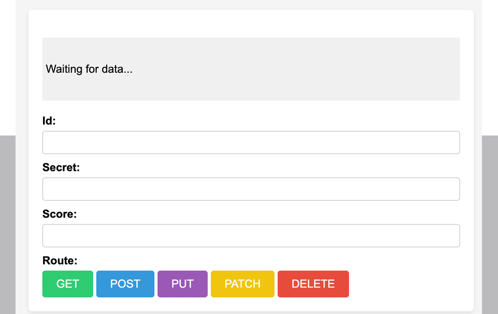

# REST APIs

This demos the 5 HTTP requests available in https://secrets-api.appbrewery.com". All require Bearer token authentication.

## What they do

GET
- User provides id and hits this button, the secret data for that id will appear in the grey area.

POST
- User provides id, a secret, and a em score. When it posts it's added as a new secret and the data will show in the grey area.

PUT
- User provides id for secret they want to update. Type in the updated secret and score. Result will update all items in that record.

PATCH
- User provides id for secret they want to update. Can type either updated score OR secret. Result will update that item and keep everything else the same.

DELETE
- User provides id of the secret they want to delete. Result will show which data object was deleted.

