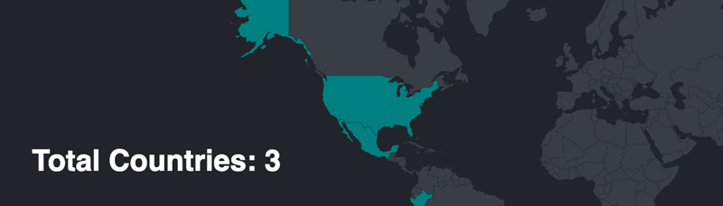

# Travel Tracker

PostgreSQL DB containing all visited_countries displayed on an interactive map to show which countries I've visited.

## The Goal
Set up new DB, query the DB, pass the server response query data back to the frontend using EJS templates.

## Tech details

The PostgreSQL DB is hosted locally on my computer.
The table is called visited_countries.

## To Start Page
Run `nodemon index.js`
Open localhost:3000
